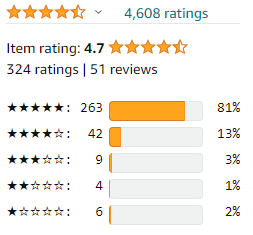

# Amazon Rating Filter
A web extension for filtering Amazon ratings to the selected product style/format instead of showing misleading aggregate ratings.

## Installing in Firefox
Instructions for loading the extension into Firefox can be found at the link below (steps have been copied):

https://developer.mozilla.org/en-US/docs/Mozilla/Add-ons/WebExtensions/Your_first_WebExtension

*1. In Firefox: Open the about:debugging page* 
*2. Click "This Firefox" (in newer versions of Firefox)* 
*3. Click "Load Temporary Add-on"* 
*4. Select the Amazon Rating Filter folder* 

## Installing in Chrome
Instructions for loading the extension into Chrome can be found at the link below (steps have been copied):

https://developer.chrome.com/docs/extensions/mv3/getstarted/

*1. Open the Extension Management page by navigating to chrome://extensions.*
- *Alternatively, open this page by clicking on the Extensions menu button and selecting Manage Extensions at the bottom of the menu.*
- *Alternatively, open this page by clicking on the Chrome menu, hovering over More Tools then selecting Extensions*

*2. Enable Developer Mode by clicking the toggle switch next to Developer mode.* 
*3. Click the Load unpacked button and select the extension directory.* 